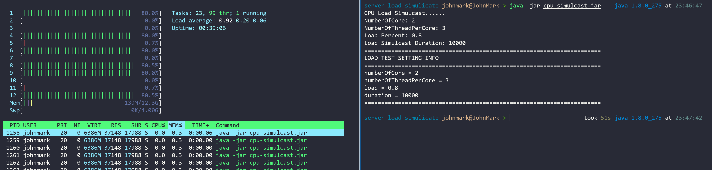

# Cpu-Load-Simulcast
Simple cpu load simulcast program written by Java


# build
```shell
./buld.sh
```

# run
```shell
java -jar cpu-simulcast.jar
```

# Cpu Load Test
### 1. CPU load increase

### 2. CPU load back to the normal
